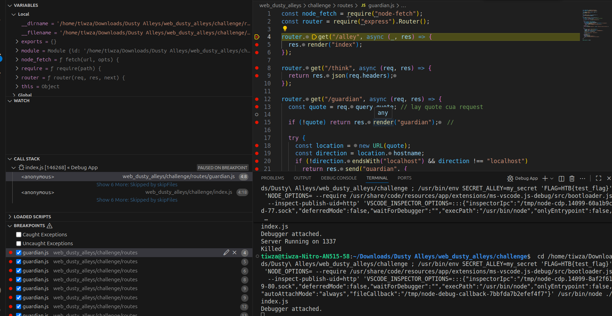

```code
{
  "version": "0.2.0",
  "configurations": [
    {
      "type": "node",
      "request": "launch",
      "name": "Debug App",
      "program": "${workspaceFolder}/web_dusty_alleys/challenge/index.js",
      "cwd": "${workspaceFolder}/web_dusty_alleys/challenge",
      "env": {
        "SECRET_ALLEY": "my_secret",
        "FLAG": "HTB{test_flag}"
      },
      "console": "integratedTerminal"
    }
  ]
}
```

