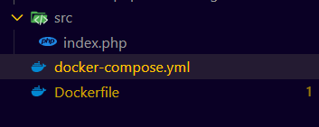
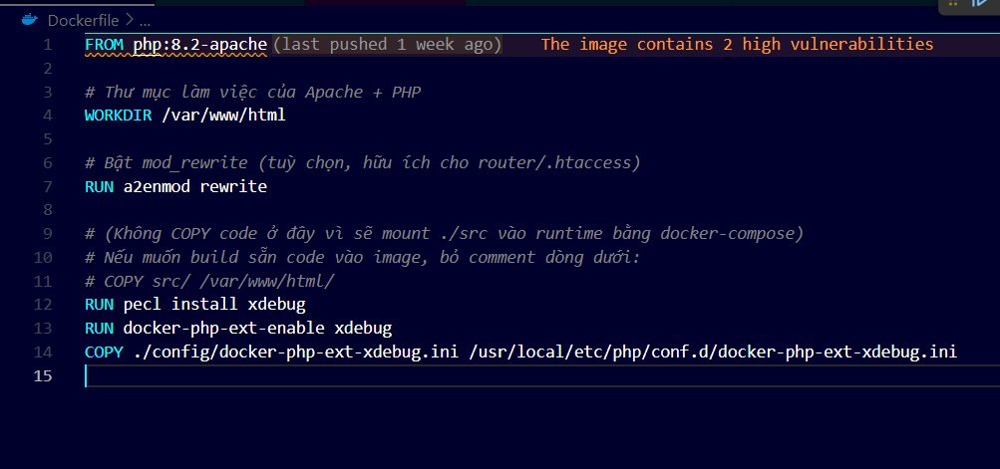
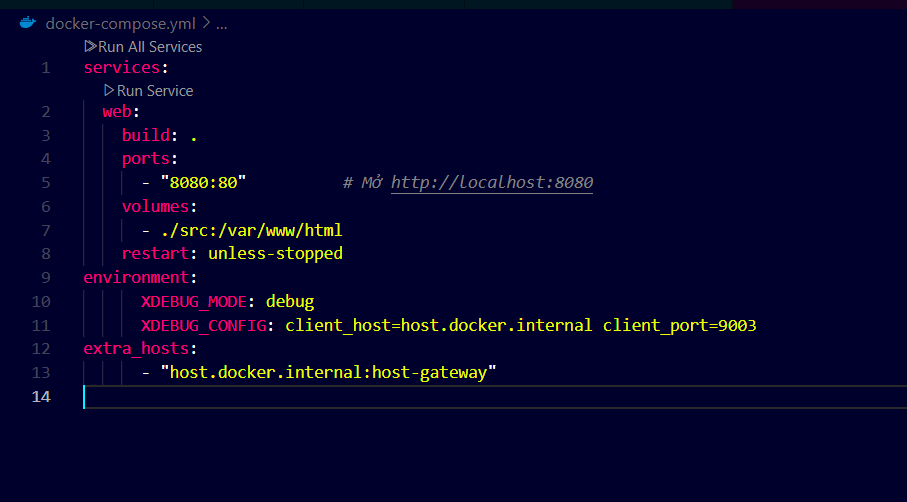
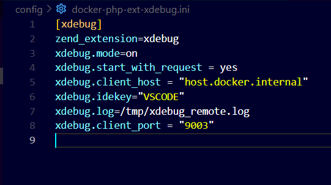
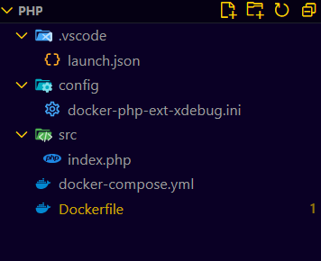

# PHP
- Ta sẽ nhận cấu trúc thư mục ban đầu như này 
    -  
- Thêm vào `Dockerfile`
```python
RUN pecl install xdebug
RUN docker-php-ext-enable xdebug
COPY ./config/docker-php-ext-xdebug.ini /usr/local/etc/php/conf.d/docker-php-ext-xdebug.ini
```
- Thêm vào `docker-compose.yml`
```python
environment:
      XDEBUG_MODE: debug
      XDEBUG_CONFIG: client_host=host.docker.internal client_port=9003
extra_hosts:
      - "host.docker.internal:host-gateway"
```
- Thêm vào `config/docker-php-ext-xdebug.ini`
```code
[xdebug]
zend_extension=xdebug
xdebug.mode=on
xdebug.start_with_request = yes
xdebug.client_host = "host.docker.internal"
xdebug.idekey="VSCODE"
xdebug.log=/tmp/xdebug_remote.log
xdebug.client_port = "9003"
```
- Sau đó 3 file sẽ nhìn như sau 
- `Dockerfile`
    -  
-  `docker-compose.yml`  
    -  
- `config/docker-php-ext-xdebug.ini`
    -   
- Cấu trúc lúc sau 
    -  