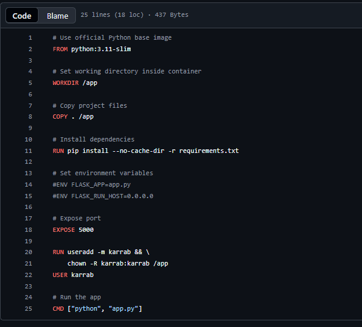
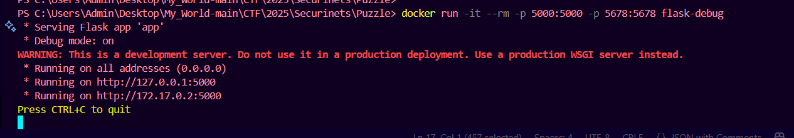
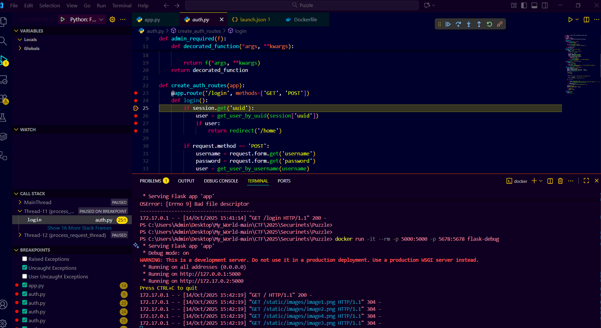
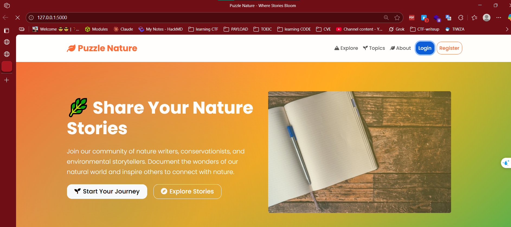

# Python (Flask)

- [Lấy ví dụ bài này để debug](https://github.com/T-Of-Me/My_World/tree/main/CTF/2025/Securinets/Puzzle)
- Cấu trúc thư mục

```code!
PUZZLE/
│
├── __pycache__/
│
├── .vscode/
│   └── launch.json
│
├── data/
│
├── db/
│
├── static/
│   ├── css/
│   │   └── style.css
│   │
│   └── images/
│       ├── image1.png
│       ├── image2.png
│       ├── image3.png
│       └── image4.png
│
├── templates/
│
├── app.py
├── auth.py
├── db.sqlite
├── Dockerfile
├── models.py
├── requirements.txt
└── routes.py

```

- `Dockerfile` lúc đầu
  - 
- `Dockerfile` lúc sau

```code!
FROM python:3.11-slim

WORKDIR /app
COPY . /app

RUN pip install --no-cache-dir -r requirements.txt \
    && pip install debugpy

EXPOSE 5000 5678

CMD ["python", "-Xfrozen_modules=off", "-m", "debugpy", "--listen", "0.0.0.0:5678", "app.py"]
```

- `.vscode/launch.json`

```code!
{
    "version": "0.2.0",
    "configurations": [
        {
            "name": "Python: Flask (Docker Attach)",
            "type": "python",
            "request": "attach",
            "connect": { "host": "localhost", "port": 5678 },
            "pathMappings": [
                { "localRoot": "${workspaceFolder}", "remoteRoot": "/app" }
            ],
            "subProcess": true,
            "justMyCode": false
        }
    ]
}
```

- Build lên
  - `docker build -t flask-debug .`
  - `docker run -it --rm -p 5000:5000 -p 5678:5678 flask-debug`
    - 
- 
- 
