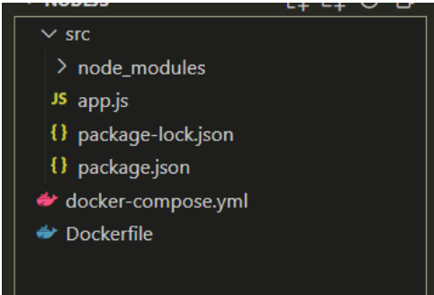
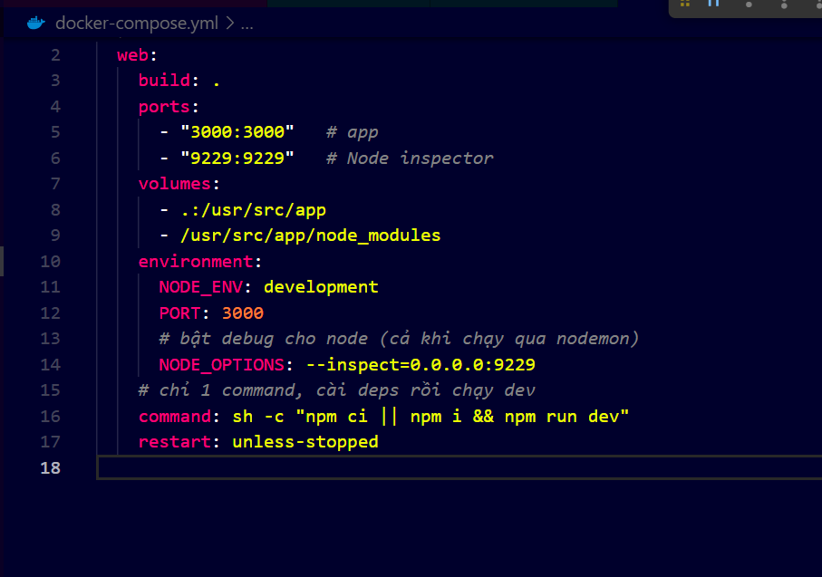
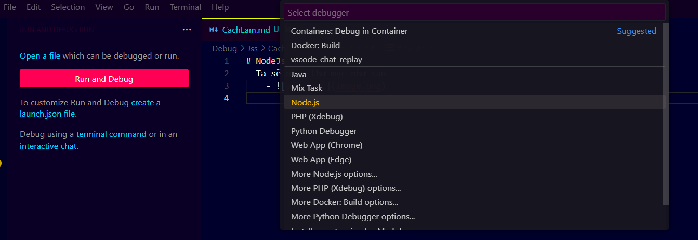
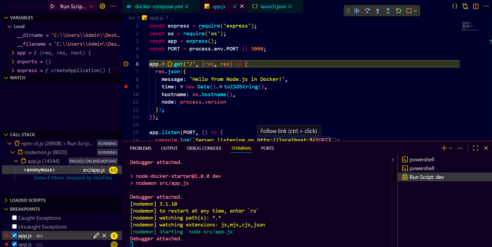

# NodeJs - debug remote
- Ta sẽ nhận thư mục như sau 
    -  
- Thêm vào file `docker-compose.yml`
```py
    ports:     
         - "9229:9229"
    command: ["node", "--inspect=0.0.0.0:9229", "app.js"]
```
- Nhìn kiểu như này 
    -  
- Gen file `launch.json`
    -  
```py
{
    // Use IntelliSense to learn about possible attributes.
    // Hover to view descriptions of existing attributes.
    // For more information, visit: https://go.microsoft.com/fwlink/?linkid=830387
    "version": "0.2.0",
    "configurations": [
        {
            "type": "node",
            "request": "attach",
            "name": "Docker: Attach to Node",
            "port": 9229,
            "remoteRoot": "/src",
            "localRoot": "${workspaceFolder}/src"
        }
    ]
}
```
**Lưu ý** : remoteRoot và localRoot sẽ map với cấu trúc src và port cũng phải đúng port đã open ở docker compose file 
 

