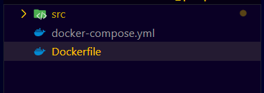
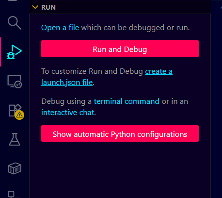
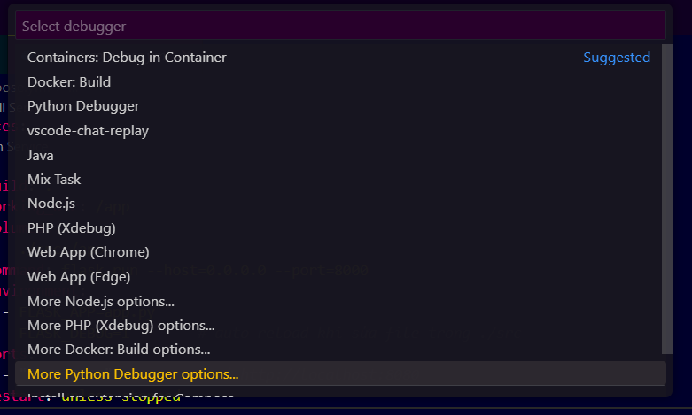
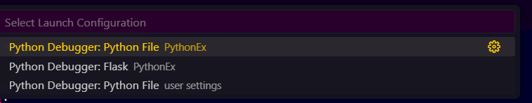
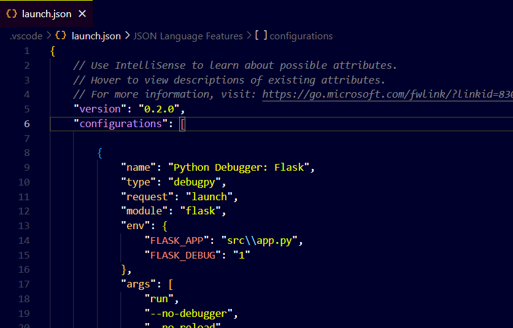
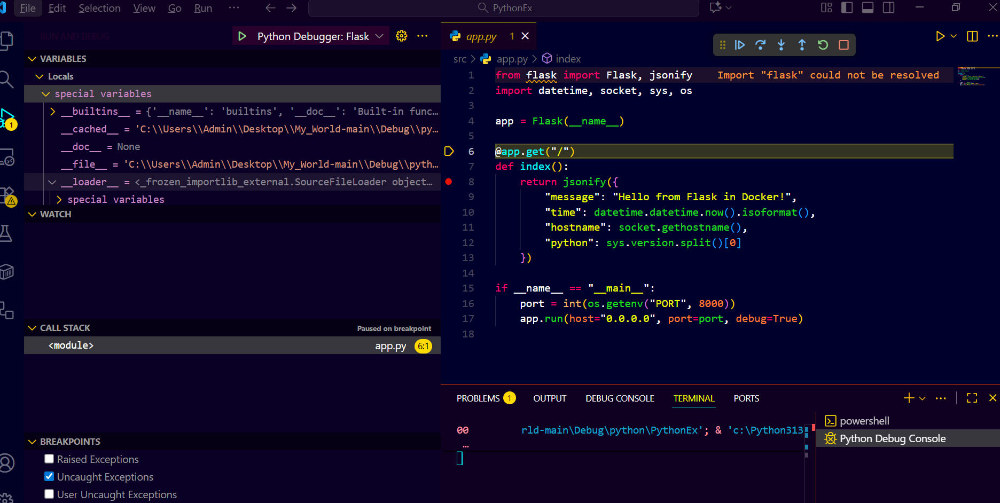
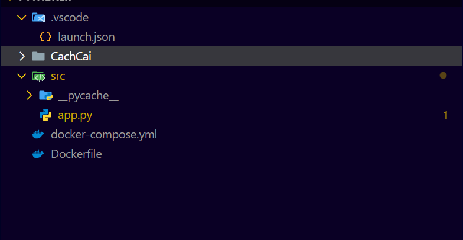

# Python (Flask)

- Ban đầu sẽ nhận file cấu trúc như sau
  - 
- `creat a launch.json file`
  - 
- `More Python Debbuger options`
  - 
- `Flask`
  - 
- Tạo `launch.json`
  - 
- End run
  - 
- Cấu trúc file lúc sau (bỏ `CachCai`)
  - 
