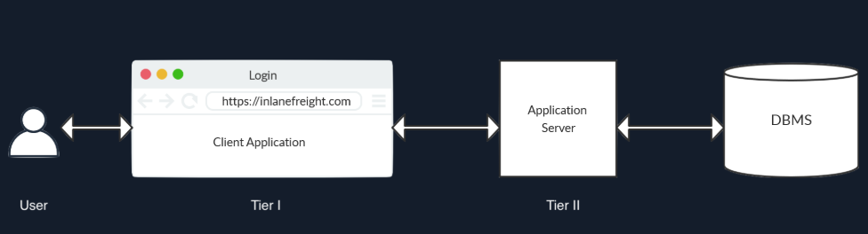

# Introduction

- When user supplied information is used to construct the query to the database, malicious users can trick the query into being used for something other than what the original programmer intended, providing the user access to query the database using an attack known as `SQL injection` (`SQLi`)
## SQL Injection (SQLi)
- First, the attacker has to inject code outside the expected user input limits, so it does not get executed as simple user input. In the most basic case, this is done by injecting a single quote `'` or a double quote `"` to escape the limits of user input and inject data directly into the SQL query.
- This can be done using SQL code to make up a working query that executes both the **intended** and **the new SQL queries**
- There are many ways to achieve this, like using [stacked queries](https://www.sqlinjection.net/stacked-queries/) or using [Union queries](https://www.mysqltutorial.org/mysql-basics/mysql-union/).
## Use Cases and Impact
- We may retrieve `secret/sensitive` information that should not be visible to us, like user logins and passwords or credit card information, which can then be used for other malicious purposes
- The most common example of this is bypassing login without passing a valid pair of username and password credentials
- Accessing features that are locked to specific users, like admin panels
- Attackers may also be able to read and write files directly on the back-end server, which may, in turn, lead to placing back doors on the back-end server, and gaining direct control over it, and eventually taking control over the entire website
