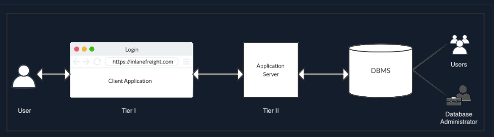

# Database Management Systems

- A Database Management System (`DBMS`) helps create, define, host, and manage databases
- Various kinds of DBMS were designed over time, such as
  - file-base
  - Relational DBMS (`RDBMS`)
  - NoSQL
  - Graph based
  - Key/Value stores.
- There are multiple ways to interact with a DBMS, such as
  - command-line tools
  - graphical interfaces
  - APIs (Application Programming Interfaces)
## Database Management Systems

Some of the essential features of a DBMS include:
| Feature | Description|
|---------|------------|
|`Concurrency`|A real-world application might have multiple users interacting with it simultaneously. A DBMS makes sure that these concurrent interactions succeed without corrupting or losing any data.|
|`Consistency`|With so many concurrent interactions, the DBMS needs to ensure that the data remains consistent and valid throughout the database.|
|`Security`|	DBMS provides fine-grained security controls through user authentication and permissions. This will prevent unauthorized viewing or editing of sensitive data.|
|`Reliability`|It is easy to backup databases and rolls them back to a previous state in case of data loss or a breach.
|`Structured Query Language`|SQL simplifies user interaction with the database with an intuitive syntax supporting various operations.|

## Architecture

- The diagram below details a two-tiered architecture.

- `Tier I` usually consists of client-side applications such as websites or `GUI` programs. These applications consist of `high-level` interactions such as user login or commenting 
- The data from these interactions is passed to Tier II through API calls or other requests.
- The second tier is the middleware, which interprets these events and puts them in a form required by the DBMS
- Finally, the application layer uses specific libraries and drivers based on the type of DBMS to interact with them
- The DBMS receives queries from the second tier and performs the requested operations . These operations could include: 
    - insertion
    - retrieval
    - deletion
    - updating of data
- After processing, the DBMS returns any requested data or error codes in the event of invalid queries.
- It is possible to host the application server as well as the DBMS on the same host. 
    - However, databases with large amounts of data supporting many users are typically hosted separately to improve performance and scalability.