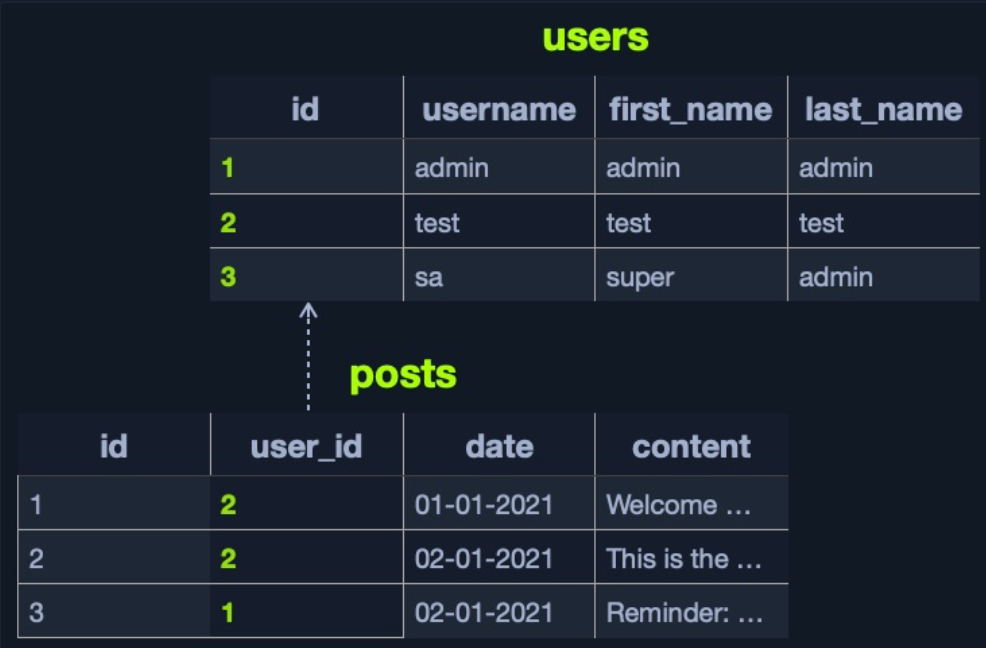
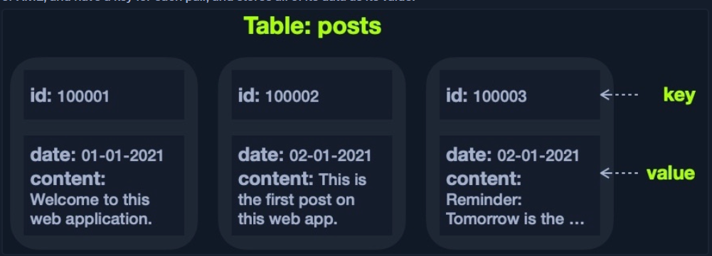

Databases, in general, are categorized into `Relational Databases` and `Non-Relational Databases`.
# Relational Databases 
- However, when processing an integrated database, a concept is required to link one table to another using its key, called a `relational database management system` (`RDBMS`).
- Many companies that initially use different concepts are switching to the `RDBMS` concept because this concept is easy to learn, use and understand. Initially, this concept was used only by large companies. However, many types of databases now implement the RDBMS concept, such as :
    - Microsoft Access
    - MySQL
    - SQL Server
    - Oracle
    - PostgreSQL, and many others
- For example, we can have a users table in a relational database containing columns like `id`, `username`, `first_name`, `last_name`, and `others`. The `id` can be used as the `table` `key`. Another table, posts, may contain posts made by all `users`, with columns like `id`, `user_id`, `date`, `content`, and so on

# Non-relational Databases
- A non-relational database (also called a `NoSQL` database) does not use `tables`, `rows`, and `columns` or `prime keys`, `relationships`, or `schemas`
- Due to the lack of a defined structure for the database, NoSQL databases are very `scalable` and `flexible`.
- Therefore, when dealing with datasets that are not very well defined and structured, a NoSQL database would be the best choice for storing such data
- There are four common storage models for NoSQL databases:
    - Key-Value
    - Document-Based
    - Wide-Column
    - Graph
- Each of the above models has a different way of storing data. For example, the `Key-Value` model usually stores data in `JSON` or `XML`, and have a key for each pair, and stores all of its data as its value:

- The above example can be represented using JSON as:
```code!
{
  "100001": {
    "date": "01-01-2021",
    "content": "Welcome to this web application."
  },
  "100002": {
    "date": "02-01-2021",
    "content": "This is the first post on this web app."
  },
  "100003": {
    "date": "02-01-2021",
    "content": "Reminder: Tomorrow is the ..."
  }
```
- It looks similar to a dictionary item in languages like `Python` or `PHP` `(i.e. {'key':'value'})`, where the key is usually a string, and the value can be a string, dictionary, or any class object.
