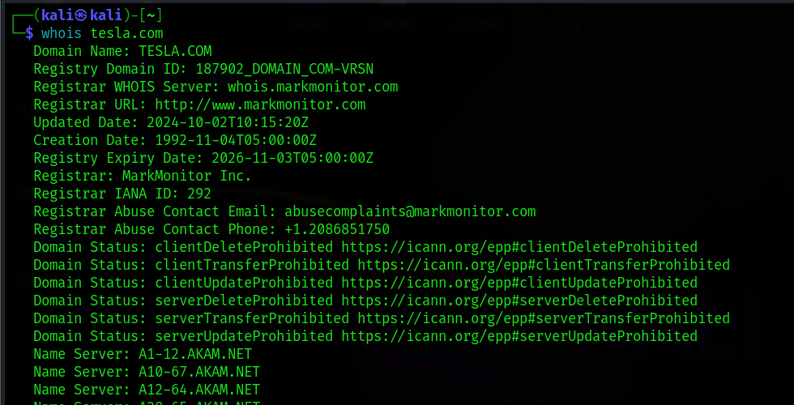
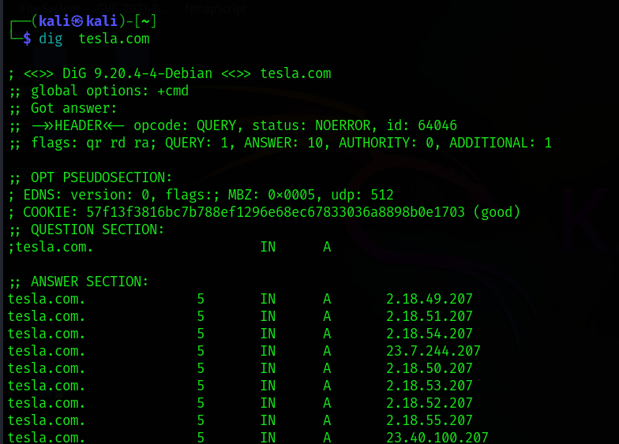
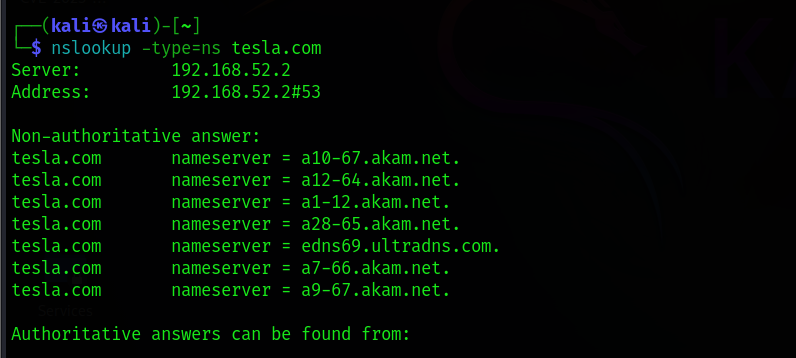
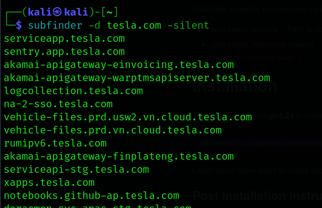
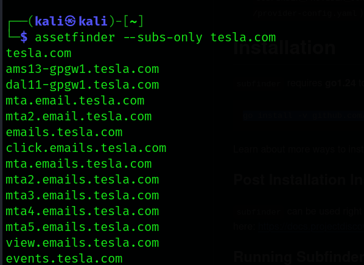
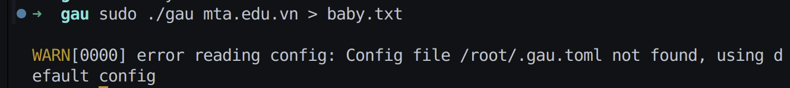
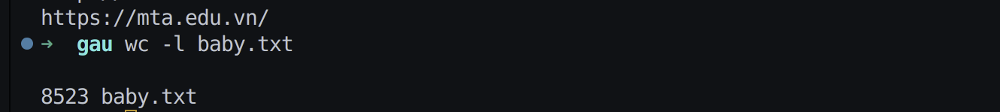
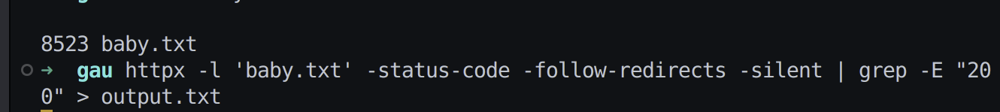
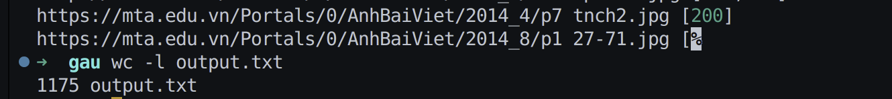

# DNS Enumeration
## PASSIVE RECONNAISSANCE 
### Lệnh: `whois tesla.com`
- 
    - Mục đích: Tìm thông tin đăng ký tên miền, gồm nhà đăng ký (`registrar`), máy chủ tên (`name servers`), ngày tạo và đôi khi cả `email`.
    - Cần chú ý:
        - Thông tin nhà đăng ký
        - `Email` quản trị (có thể dùng cho `social engineering` hoặc chiếm quyền `email`)
        - Ngày tạo và ngày hết hạn tên miền (hữu ích cho `phishing` hoặc kiểm thử trang giả mạo)
        - Máy chủ tên (có thể hé lộ hạ tầng ẩn)

### Lệnh (tìm bản ghi A): `dig tesla.com`
- 
### Lệnh (liệt kê tất cả bản ghi): `dig tesla.com ANY`
### Lệnh (lấy name `server`): `nslookup -type=ns tesla.com`
- 
    - Cần chú ý:
        - `A record`: địa chỉ IP chính
        - `MX record`: máy chủ thư
        - `TXT record`: đôi khi chứa thông tin hữu ích như `SPF`, xác minh `Google`

### Dùng crt.sh (mở trên trình duyệt): `https://crt.sh/?q=%.tesla.com`
- Ghi chú nhỏ: Nhiều trình duyệt yêu cầu mã hoá ký tự `%` thành`%25`, khi đó URL sẽ là `https://crt.sh/?q=%25.tesla.com`
### Dùng Subfinder: `subfinder -d tesla.com -silent`
- 
### Dùng Assetfinder: `assetfinder --subs-only tesla.com`
- 

## ACTIVE RECONNAISSANCE

### Directory and File Enumeration
- Purpose: Find hidden pages or directories not linked from the homepage.
- Command:
```code
ffuf -u https://www.tesla.com/FUZZ -w /usr/share/seclists/Discovery/Web-Content/common.txt -fc 404
```
- What to look for:
```code
/admin  
/backup  
/login  
/api  
/dev
```
- Use wordlists from SecLists (apt install seclists).


### Technology and Framework Detection 
- Wappalyzer (Browser Extension)

- [BuiltWith](https://builtwith.com/)
- whatweb : `whatweb https://www.tesla.com`
- httpx with tech detection : `httpx -l domains.txt -tech-detect -title -status-code -web-server`
    - Kiểm tra trạng thái sống của domain/subdomain (status code, redirect, title, length)
    - Phát hiện công nghệ web, TLS info, favicon hash, CNAME, IP, Server header, v.v.
    - Hỗ trợ pipeline với các tool như subfinder, naabu, nuclei để tự động hóa toàn bộ flow

## Harvest URLs Using Gau & Filter with Httpx   
- `sudo ./gau mta.edu.vn > baby.txt`
    - 
    - 
- `httpx -l 'baby.txt' -status-code -follow-redirects -silent | grep -E "200" > output.txt`
    - 
    - 
- Chuỗi lệnh 
```code!
gau example.com | tee all_urls.txt
cat all_urls.txt | sort -u | httpx -silent -status-code -follow-redirects \
  | grep -E "200|301|302|307|308" > alive.txt
```

