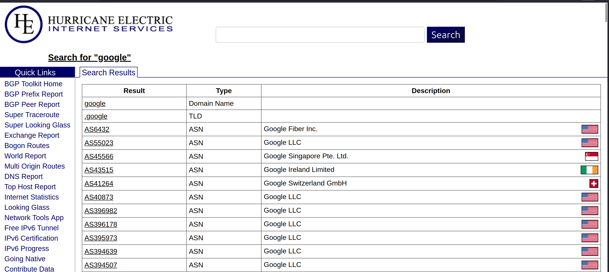
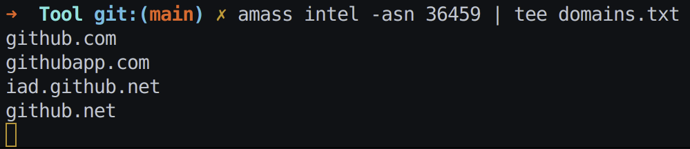

# IP Ranges 
- [Tìm trong này](https://bgp.he.net/)
- 
=> từ tên domain lấy được ASN
# Reverse Lookup from ASN using amass
- Lấy domain và IP thuộc ASN
    - Thu thập intel (passive) — lấy domain và IP thuộc ASN
        - 
        - `amass intel -asn 36459 | tee domains.txt`
# Finding Subdomains 
## Linked (spidering) 
-   