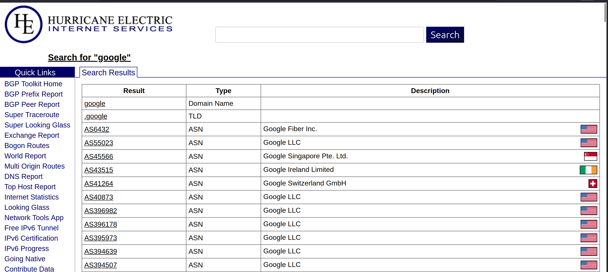
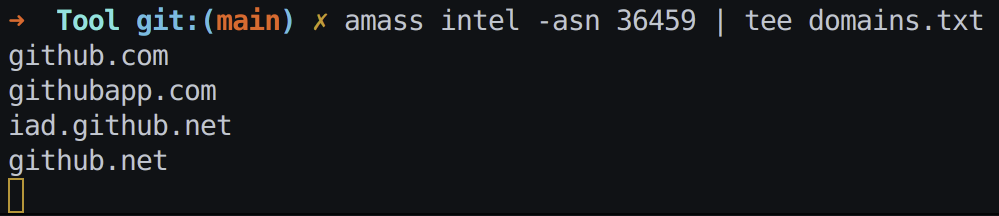
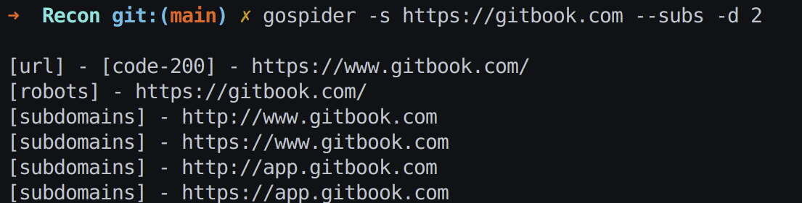
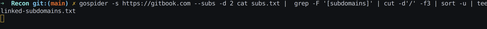
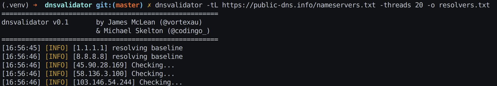
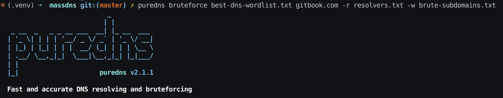
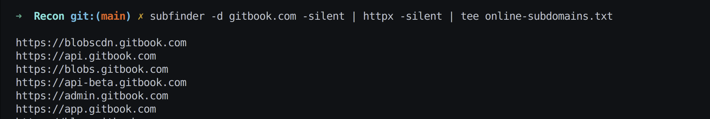
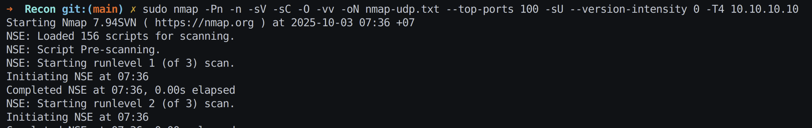

# IP Ranges 
- [Tìm trong này](https://bgp.he.net/)
- 
=> từ tên domain lấy được ASN
# Reverse Lookup from ASN using amass
- Lấy domain và IP thuộc ASN
    - Thu thập intel (passive) — lấy domain và IP thuộc ASN
        - 
        - `amass intel -asn 36459 | tee domains.txt`
# Finding Subdomains 
## Linked (spidering) 
- Dùng để tìm subdomain 
    - 
    - `gospider -s https://gitbook.com --subs -d 2`
- Làm sạch tên miền 
    - 
    - `$ gospider -s https://gitbook.com --subs -d 2 cat subs.txt | grep -F '[subdomains]' | cut -d'/' -f3 | sort -u | tee linked-subdomains.txt
www.gitbook.com
docs.gitbook.com
blog.gitbook.com`
## Scraping 
- **subfinder** gom nhiều kỹ thuật open-source (CT, Google, GitHub, v.v.) để trả về danh sách subdomain:
    - Chưa tải được mạng yếu vl 
    - `subfinder -d gitbook.com -o scraped-subdomains.txt`
## Brute Force
- [best-dns-wordlist](https://wordlists-cdn.assetnote.io/data/manual/best-dns-wordlist.txt)
- [DNS công bố](https://public-dns.info/nameservers.txt)
- Tìm DNS resolver 
    - 
    - `dnsvalidator -tL https://public-dns.info/nameservers.txt -threads 20 -o resolvers.txt`
- Puredns Bruteforce
    - 
    - `puredns bruteforce best-dns-wordlist.txt gitbook.com -r resolvers.txt -w brute-subdomains.txt`
# Confirming Status 
- subfinder quét ra danh sách subdomain.
- Output được pipe `(|)` cho **httpx** để thử kết nối **HTTP/HTTPS**.
- Kết quả **subdomain** nào online sẽ được in ra + lưu vào **online-subdomains.txt**.
-  
- `subfinder -d gitbook.com -silent | httpx -silent | tee online-subdomains.txt`
# Masscan
## Find open ports
- Quét thôi 
- `sudo masscan 192.168.1.0/24 -p- --rate 100000 -oX out.xml`
## Convert output to nmap format 
- Chỉnh lại cho phù hợp với nhiều tool khác 
- `sudo chown $USER:$(id -gn) $1
sed -i '/<!-- masscan v1.0 scan -->/d' $1`
# Nmap 
- `sV` — dò phiên bản phần mềm (service/version detection).

 `O` — dò hệ điều hành (OS detection).

- `sC` — chạy các script mặc định an toàn (default safe NSE scripts).

- `Pn` — không ping trước (bỏ bước phát hiện host; coi host luôn online).

- `n` — không phân giải DNS (không tra tên từ IP).

- `sS` — Stealth scan (TCP SYN scan, mở nửa kết nối; thường cần sudo).

- `T4` — cấu hình tốc độ scan (T0..T5); -T4 là nhanh, cân nhắc khi an toàn.

- `oN [filename]` — xuất kết quả dạng text thường vào file.

- `p [ports]` — chỉ định cổng (ví dụ -p80,443 hoặc -p1-1024, -p- = tất cả cổng).

- `sU` — quét UDP thay vì TCP (chậm và hay thiếu nhất quán).

- `vv` — verbose hơn, in nhiều thông tin trong lúc quét.
- 
- `nmap [options] 10.10.10.10`
- `sudo nmap -sV -O -sC -Pn -n -sS -T4 -oN nmap.txt -p- -vv 10.10.10.10`
- `sudo nmap -Pn -n -sV -sC -O -vv -oN nmap-udp.txt --top-ports 100 -sU --version-intensity 0 -T4 10.10.10.10`