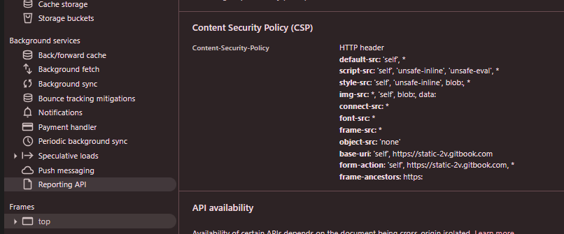

# CSP (Content-Security-Policy)

## Mô tả

- Hừm đầu tiên muốn bypass được CSP thì phải CSP là gì
  - Thì nó là giá trị của header `Content-Security-Policy:` hoặc là `<meta>` trong phản hồi nó nói với browser rằng những thứ được làm và không được làm
- Và điều quan trọng nó sử dụng `script-src` để thiết lập , xác định nơi mà JavaScript có thể đến từ đâu hay nói một cách dễ hiểu là chỉ những Script đến từ những domain được xác định trong CSP thì mới được thực thi :

```code
Content-Security-Policy: script-src 'self' https://example.com/
```

hoặc

```code
<meta http-equiv="Content-Security-Policy"
      content="script-src 'self' https://example.com/">
```

- Bạn có thể check `CSP` của trang web đơn giản bằng cách (inspect -> top -> `CSP`)
  - 
- Với thiết lập `police` như sau : `<script src=...>` bất cứ `domain` nào không thuộc sẽ bị block
  - Với police như vậy cũng đồng nghĩa với việc chặn inline script `<script>alert()</script>` hoặc event handlers like `<style onload=alert()>`
- Tuy nhiên ở 1 vài browser nếu dùng `script src=...>` thì trình duyệt chặn tất cả các **inline script** dẫn đến hỏng trang web ; và để chữa cháy cho việc này họ thêm [`unsafe-inline`](https://developer.mozilla.org/en-US/docs/Web/HTTP/Reference/Headers/Content-Security-Policy/script-src#unsafe_inline_script) => đã mở ra các atk surface khác thú vị hơn
- Hừm có 1 cách khác để ngăn chặn XSS là dùng **Nonce**(number used once)
  - Hiểu đơn giản là phía client sẽ nhận về 1 tham số random từ hai nguồn là header và body html
  - Như vậy mỗi lần render là 1 tham số khác nhau tương ứng , Atk không thể đoán được tham số khi đã chèn được html 
  - Sau đây là code mô phỏng
```code
HTTP/1.1 200 OK
Content-Security-Policy: script-src 'nonce-r4Nd0mV4l' 'strict-dynamic'

<html>
  <head>
    <script nonce="r4Nd0mV4l">
      console.log("This script runs");
    </script>

    <script>
      console.log("This one will be BLOCKED");
    </script>
  </head>
</html>
```

- Nếu fillter bằng nonce này thì khỏi nghĩ đến việc XSS đi nhé  
- `unsafe-eval`
    - bị vô hiệu hoá chặn trong default của CSP
```code!
eval("alert('hi')")          // Bị chặn
new Function("alert('hi')")  // Bị chặn
setTimeout("alert('hi')", 500) // Bị chặn
setInterval("alert('hi')", 500) // Bị chặn
```
- Tuy nhiên `unsafe-eval` không hoàn toàn chặn XSS
    - Nếu vẫn cho phép `unsafe-inline` thì vẫn có thể 
```code
document.body.setAttribute('onclick', 'alert(origin)')
document.body.click() // vẫn thực thi được
```
Hoặc 
```code!
location = "javascript:alert(origin)"
```